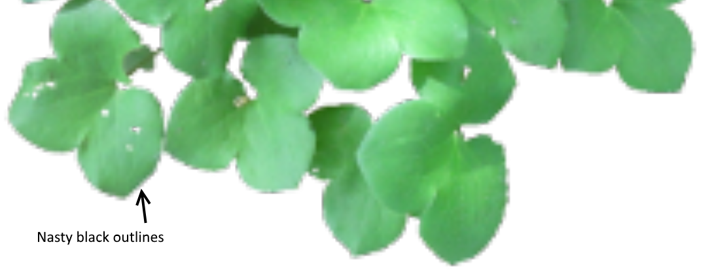
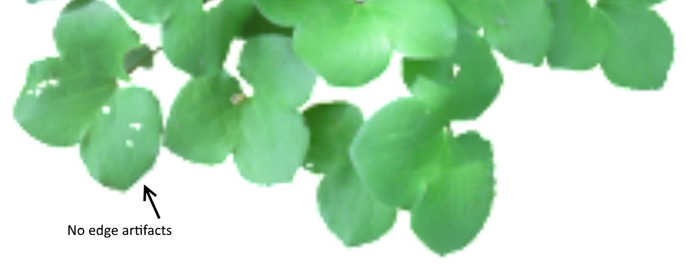
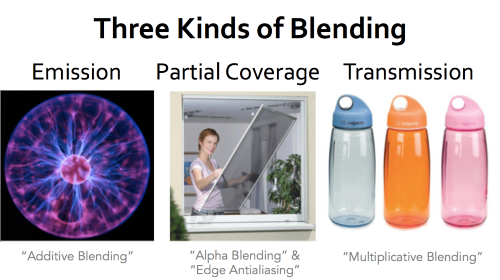

# Pre-Multiplied Alpha
Pre-Multiplied alpha blend is a blend mode has been around for a long time, but it seems to be re-discovered every few years.

Typically, the primary reason to  use pre-multiplied alpaha is to get rid of back outlines when rendering.

For example, if you are rendering some leaves, you have an alpha channel indicating the leaf edges.

|  |   | 
|:--:| :--:|
| *A typical alpha blended texture* | *The color channels in the texture* |

Rendering with the standard blend mode (alpa, 1-alpha) resiults in color bleeding in around the leaf edges. (ie. black)

 

Most games resolve this by having artists fill in these background areas with a fill color (ie green).
*However* by pre multiplying the image offline and using pre-Multiplied alpha blend mode (1, 1-alpha) this in fill is not necessary.

 

## The three in one blend mode

|  | 
|:--:| 
| *Blend  modes from Morgan McGuire presentation* |

## Reducing draw calls with Pre-Multiplied Alpha

## Links

There are may other resons to use pre-multipled alpha. Some of which are listed below:

http://www.realtimerendering.com/blog/gpus-prefer-premultiplication/
http://webglfundamentals.org/webgl/lessons/webgl-and-alpha.html
http://tomforsyth1000.github.io/blog.wiki.html#[[Premultiplied%20alpha%20part%202]]
https://developer.nvidia.com/content/alpha-blending-pre-or-not-pre
http://www.adriancourreges.com/blog/2017/05/09/beware-of-transparent-pixels/

## Tools
This project includes descriptions/examples and tools for using pre-multiplied alpha.
