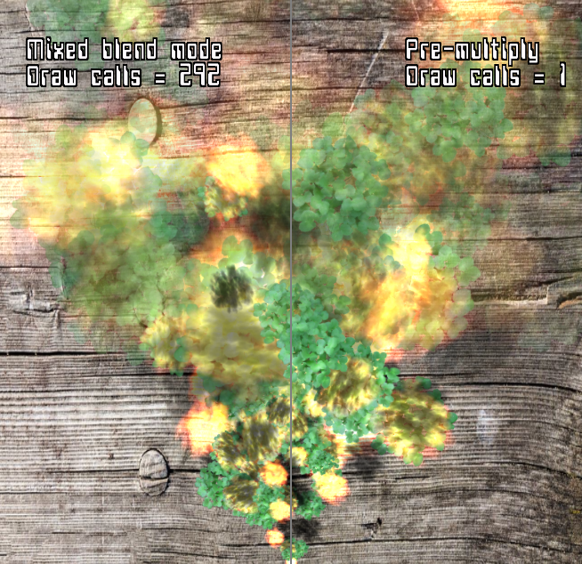

# Pre-Multiplied Alpha
Pre-Multiplied alpha blend is a blend mode has been around for a long time, but it seems to be re-discovered every few years. 

This article focuses on using pre-multiplied alpha to batch a lot of blending modes together. This batching has become very important in modern famerate sensitive applications like VR on mobile. 

[](https://www.youtube.com/watch?v=belVA1C013A "Unity max performance")

## Introduction
Typically, the primary reason to  use pre-multiplied alpha is to get rid of black outlines when rendering.

For example, if you are rendering some leaves, you have an alpha channel indicating the leaf edges.

|  |   | 
|:--:| :--:|
| *A typical alpha blended texture* | *The color channels in the texture* |

Rendering with the standard blend mode (alpha, 1-alpha) results in color bleeding in around the leaf edges. (ie. black)

 

Most games resolve this by having artists fill in these background areas with a fill color (ie green).
*However* by pre-multiplying the image offline and using pre-multiplied alpha blend mode (1, 1-alpha) this "in fill" is not necessary.


 


```
Tip: The DXT1A texture compression format was designed for use with pre-multiplied alpha.
```

By using pre-multiplied alpha you also resolve issues with color bleeding in mip map generation: https://developer.nvidia.com/content/alpha-blending-pre-or-not-pre

There are some disadvantages of pre-multiplied blending (eg. it is a lossy operation on the color) but in general, it should be the default blending mode. See the attached links for further discussion. 

## The three in one blend mode

There are three main blend modes used in games:
- Additive - Used in sparks, fire, lights, glowing objects etc.
- Alpha Blend - Used in leaves, fences, smoke etc.
- Multiply - Used in stained glass windows, darkening smoke effects

|  | 
|:--:| 
| *Blend  modes from Morgan McGuire presentation* |

All three blending modes can be used as the pre-multiply blend mode by pre-processing the textures.
- Additive - Set alpha to zero.
- Alpha Blend - Multiply the color by the alpha value.
- Multiply - Limited to greyscale multiply. Store (1 - red) in the alpha channel, then set color to black. 

Then at runtime, the blend mode can be set to (1, 1 - alpha). This is the blend mode code for OpenGL:
```
glBlendFunc(GL_ONE, GL_ONE_MINUS_SRC_ALPHA);
```


```
Tip: The multiply blend mode only supports a grey scale value when using pre-multiplied alpha.
By exporting two colors and doing multiply+add as the blend mode would support the full multiply blend mode.
You need "Dual Source Blending" support for this (eg. GL_ARB_blend_func_extended)
```

## Reducing draw calls/state changes with Pre-Multiplied Alpha

In a typical game engine, each particle system is rendered separately with it's own blend mode and textures.
(eg. 10 PFX's playing, results in 10 draw calls)

Some batching might be able to be done with texture atlasing, but the different blend modes will break most batching attempts.

Consider the worst case of a particle effect that changes blend mode on a per-particle basis - eg. smoke with sparks interspersed. This will require changing the blend mode on a per particle basis in order to do correct rendering.

By switching to pre-multiplied blend mode for all particle effects, and entire scene can be done with one draw call (assuming atlasing/2D array for the textures)

|  | 
|:--:| 
| *An example PFX using multiple blend modes. Left is switching blend mode, right is using pre-multiplied blending* |


## Reducing overdraw with Pre-Multiplied Alpha

Another neat trick with pre-multiplied alpha is that if you have overlapping textures that are in known positions, you can pre-process them all down to one texture.

For example, if you have flipbook animation of a spinning coin, you can add a glow additive effect on top for free. Or if you have a smoke particle effect, you could add sparks to the smoke textures and render them for free.

**Using pre-multiplied blending you can effectively vary the blend mode per texel in the texture!**

Another example is if you have a head up display UI in the game made up of different blended elements. 

|  | + |  | + | | = |  | 
|:--:|:--:|:--:|:--:|:--:|:--:|:--:|
| *Blend texture* | | *Additive texture* | | *Inverse multiply texture* | | *Combined texture* |

See the Tools for an example combining tool.

```
Tip: There is no limit to the number of textures you can combine, 
but you may start getting artifacts unless the textures and destination buffer is HDR.
```


## Tools
This project includes descriptions/examples and tools for using pre-multiplied alpha.

#### BlendProcess
This tool is a command line utility to convert textures for pre-multiply blending. 

It can also be used to combine textures of different blend modes into a single pre-multiply blend texture.

Ensure the "-sRGB" option is specified if in your rendering engine blending is done in a gamma correct space. (ie texture lookups convert from sRGB to linear space)

```
Usage: BlendProcess.exe [-sRGB] <input blend> <input file> outputfile.png
 "-sRGB" - Optional. Input is converted from sRGB to linear before blending
Input blend can specify one of the following:
 "-a"  - input is additive
 "-b"  - input is alpha blend
 "-m"  - input is multiply (red channel)
 "-im" - input is inverse multiply (red channel)
 "-p"  - input is pre-mul alpha

Note that you can can supply as many input blend/input file pairs as needed.

eg. BlendProcess.exe -a base.png -b blend.png out.png

To add more layers: BlendProcess.exe -p out.png -b new.png out.png
Input file can be of several formats, but output is always png.
```

#### BlendDemo

An example blending demo to demonstrate rendering multiple blend modes in one draw call. The particle effect can spawn one of four blend modes:
- Additive
- Multiply
- Alpha blending
- Combined (Alpha blending/Additive/Multiply)

The left side using traditional blending, with the right side using pre-multiplied alpha. 
Note that the combined blend mode does look different as the pre-mul blend mode is at a higher precision.
Using HDR for blending should result in the same output.

Use the left mouse button to click and drag the divider.


## Links

There are may other reasons to use pre-multiplied alpha. Some of which are listed below:

http://www.realtimerendering.com/blog/gpus-prefer-premultiplication/

http://webglfundamentals.org/webgl/lessons/webgl-and-alpha.html

http://tomforsyth1000.github.io/blog.wiki.html#[[Premultiplied%20alpha]]

http://tomforsyth1000.github.io/blog.wiki.html#[[Premultiplied%20alpha%20part%202]]

Why pre-multiply blend mode should be used in mip map generation:

https://developer.nvidia.com/content/alpha-blending-pre-or-not-pre

http://www.adriancourreges.com/blog/2017/05/09/beware-of-transparent-pixels/

https://blogs.msdn.microsoft.com/shawnhar/2009/11/06/premultiplied-alpha/


